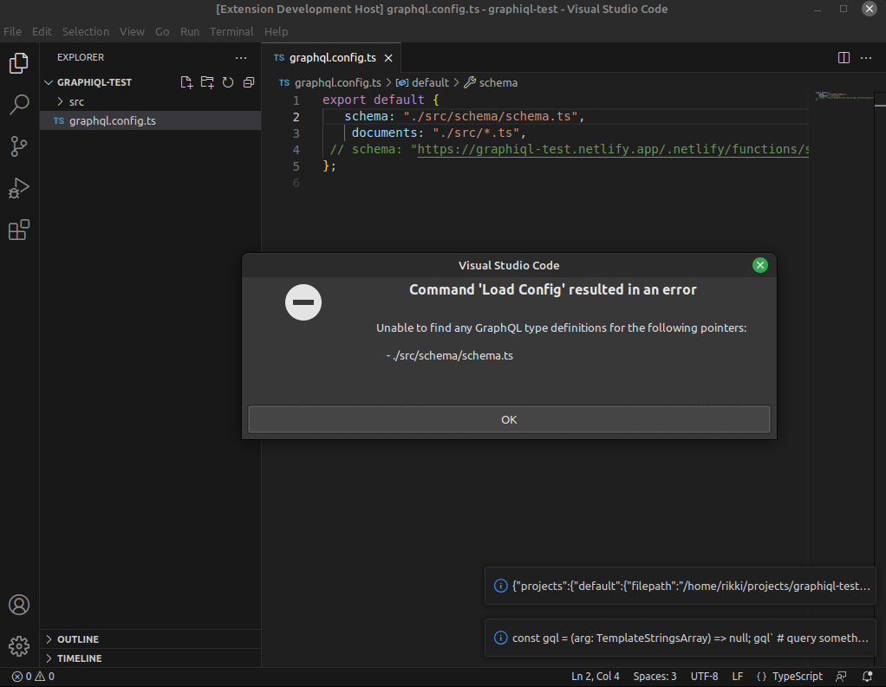

# Setup

npm install

# Reproducing the bug

0. open this project in vscode
1. Run `F5` or manually navigate to debugger tab, and choose 'Run Extension' green arrow next to 'Run and Debug'
2. Open the provided `example-project` directory
3. Run "load config"

